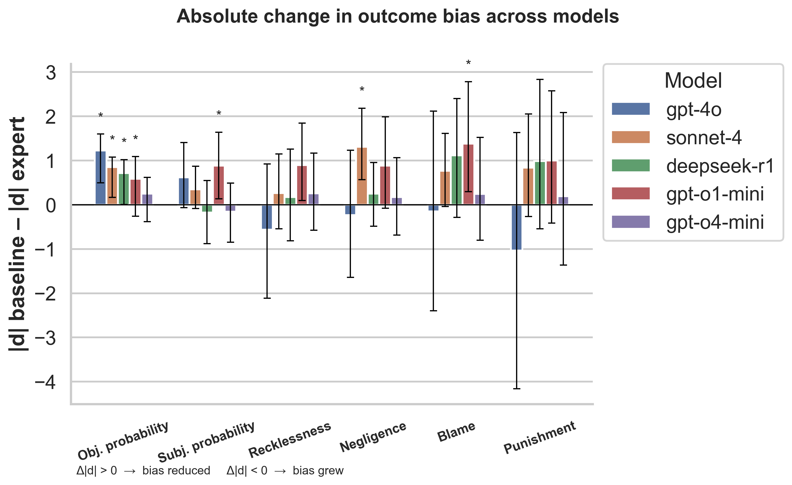
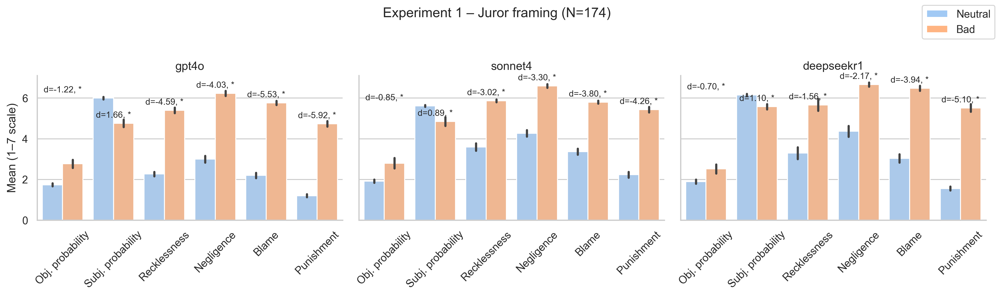
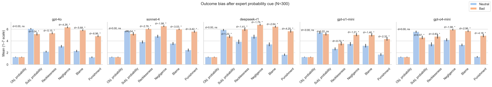

# Outcome Bias in Large Language Models

Conduct outcome bias studies study 1 and study 5 in Kneer and Skoczeń (2023) human participants outcome bias, study 1 (Baseline) – scenario followed by a neutral or harmful outcome, Study 5 (Expert) conducted for LLMs.

**Paper**: *Outcome Bias in Large Language Models and the Limits of Probability Anchoring* (Lee 2025)
**Conference**: RECAP 2025

This repository contains the complete code and data for reproducing the experiments and results reported in our paper.

*This work began during the pilot run of [RECAP](https://recap.sg/), a version of the ARENA program run in Singapore.*

## Abstract

We investigate outcome bias in large language models (LLMs) using negligence scenarios adapted from legal psychology. Through experiments with five frontier models (GPT-4o, Claude Sonnet-4, DeepSeek-R1, GPT-o1-mini, GPT-o4-mini), we demonstrate that LLMs exhibit systematic outcome bias: they judge identical negligent actions more harshly when they result in harmful outcomes versus neutral ones. We further test whether providing expert probability information can reduce this bias, finding mixed effectiveness across models and measures.

## Quick Start

### Installation

```bash
git clone https://github.com/[username]/bias_llmeval.git
cd bias_llmeval
pip install -r requirements.txt
```

### API Keys Setup

Create a `.env` file in the project root with your API keys:

```bash
OPENAI_API_KEY=your_openai_key_here
ANTHROPIC_API_KEY=your_anthropic_key_here
DEEPSEEK_API_KEY=your_deepseek_key_here
```

### Reproduce Paper Results

```bash
# Run experiments for both studies (requires API keys)
python src/check_and_fill.py --models gpt4o sonnet4 deepseekr1 o1mini o4mini --study 1 --frame juror
python src/check_and_fill.py --models gpt4o sonnet4 deepseekr1 o1mini o4mini --study 5 --frame juror

# Generate all analyses and figures from the paper
./run_analysis.sh
```

**Note**: Running the full experiments requires API access and may incur costs (~$50-100 total). Pre-computed results are included in `results/` for immediate analysis.

## Experimental Design

### Scenarios

Ten negligence vignettes were used (see [`data/vignette_parts.json`](data/vignette_parts.json)), with agent decisions and harm probabilities held constant so only outcomes differed by chance. Two scenarios ("flood" and "traffic") were adapted from Kneer and Skoczeń (2023), while eight new scenarios were constructed across diverse domains.

### Studies

We present these ten scenarios to five frontier models under two conditions:

1. **Study 1 (Baseline)** – scenario followed by a neutral or harmful outcome
2. **Study 5 (Expert)** – an "expert witness" states the prior probability of harm (2–7%) before the outcome

### Models Evaluated

| Internal ID | Model Name | Developer |
|-------------|------------|-----------|
| `gpt4o`     | GPT-4o | OpenAI |
| `sonnet4`   | Claude Sonnet-4 | Anthropic |
| `deepseekr1`| DeepSeek-R1 | DeepSeek |
| `o1mini`    | GPT-o1-mini | OpenAI |
| `o4mini`    | GPT-o4-mini | OpenAI |

### Data Collection

- **60 responses per study per model** (10 scenarios × 2 outcomes × 3 completions)
- **300 responses per model total** across both studies
- **1,500 model completions total**
- All statistical analyses performed offline with bootstrap resampling

## Key Results

### Main Findings

1. **Systematic Outcome Bias**: All models show significant outcome bias, judging identical negligent actions more harshly when they result in harmful vs. neutral outcomes.

2. **Limited Expert Intervention**: Providing expert probability information reduces bias for some measures but shows inconsistent effectiveness across models.

3. **Model Differences**: Reasoning models (o1-mini, o4-mini) show different bias patterns compared to standard models.

### Paper Figures

- **Figure 1: Absolute reduction in bias (|d|)**

  

- **Figure 2: Study 1 (Baseline) – all dependent variables**

  

- **Figure 3: Study 5 (Expert) – all dependent variables**

  

### Statistical Results

Key tables are generated in `results/tables/`:
- `exp6_vs_baseline.csv` - **Table A1**: Outcome effect sizes at baseline and after expert cue
- `anova_interactions.csv` - **Table A2**: Outcome × Expert ANOVA results (per variable, pooled across models)
- `abs_diff.csv` - Absolute effect size differences for bias reduction analysis

## Repository Structure

```
bias_llmeval/
├── src/                          # Source code
│   ├── run_experiment.py         # Main experiment runner
│   ├── check_and_fill.py         # Ensure complete data collection
│   ├── model_api.py              # API wrappers for all models
│   ├── prompts.py                # Prompt templates and generation
│   ├── parser.py                 # Response parsing and validation
│   ├── stats_expert_vs_baseline.py  # Table A1 generation
│   ├── anova_expert_interaction.py  # Table A2 generation
│   ├── extend_outcome_bias.py    # Core effect size analysis
│   ├── compute_abs_diff.py       # Bias reduction calculations
│   ├── plot_abs_diff.py          # Figure 1 generation
│   └── plot_all_dvs.py           # Figures 2 & 3 generation
├── data/
│   └── vignette_parts.json       # Scenario components and variables
├── results/
│   ├── clean/data.csv            # Processed experimental data
│   ├── figures/                  # Paper figures
│   └── tables/                   # Statistical tables
├── config.yaml                   # Model configurations
├── requirements.txt              # Python dependencies
└── run_analysis.sh              # Complete analysis pipeline
```

## Citation

```bibtex
@inproceedings{lee2025outcome,
  title={Outcome Bias in Large Language Models and the Limits of Probability Anchoring},
  author={Lee, JiaQie},
  booktitle={Proceedings of RECAP 2025},
  year={2025}
}
```

## License

This project is licensed under the MIT License - see the LICENSE file for details.

## Acknowledgments

- Kneer, Markus and Skoczeń, Izabela, Outcome Effects, Moral Luck and the Hindsight Bias (March 22, 2021). Kneer, M., & Skoczeń, I. (2023). Outcome effects, moral luck and the hindsight bias. Cognition, 232, 105258. https://doi.org/10.1016/j.cognition.2022.105258
- Built with APIs from OpenAI, Anthropic, and DeepSeek