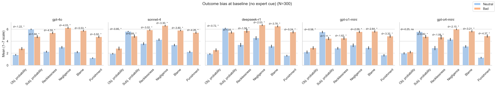

# Outcome Bias in Large Language Models (RECAP 2025)

This repository hosts the **data and headline figures** for the negligence-scenario experiments described in the RECAP report *Outcome Bias in Large Language Models and the Limits of Probability Anchoring* (Lee 2025).  The helper scripts used during data collection are **not** maintained for public reuse; therefore no installation or quick-start instructions are provided here.

We present ten negligence scenarios (adapted from Kneer & Skoczeń, 2023) to five frontier chat models under two conditions:

1. **Baseline** – scenario followed by a neutral *or* harmful outcome.
2. **Expert** – an “expert witness” states the prior probability of harm (2–7 %) before the outcome.

### Models evaluated

| internal id | Model name |
|-------------|------------|
| `gpt4o`     | GPT-4o |
| `sonnet4`   | Claude Sonnet-4 |
| `deepseekr1`| DeepSeek-R1 |
| `o1mini`    | GPT-o1-mini |
| `o4mini`    | GPT-o4-mini |

Each model contributes **60 responses per study** (10 scenarios × 2 outcomes × 3 completions).
Across the five studies reported in the paper this amounts to **300 responses per model** and
**1 500 model completions in total**.  All further bootstrap resampling is performed offline.

## Key Results

Below are the headline plots from the replication. They summarise the effect sizes across models and conditions at a glance.

- **Absolute reduction in bias (|d|)**
  
  

- **Baseline vs expert – all dependent variables (Study 1, juror framing)**
  
  

- **Expert-probability condition – all dependent variables (Study 5, juror framing)**
  
  

For a full statistical breakdown see the `results/tables/` directory or run the analysis pipeline.